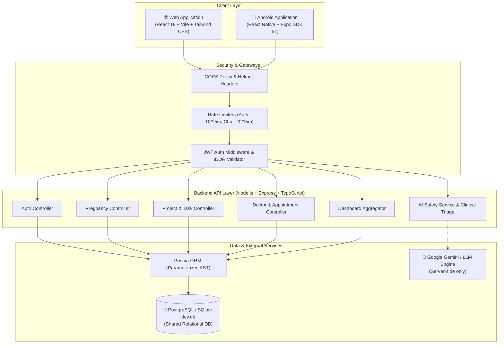
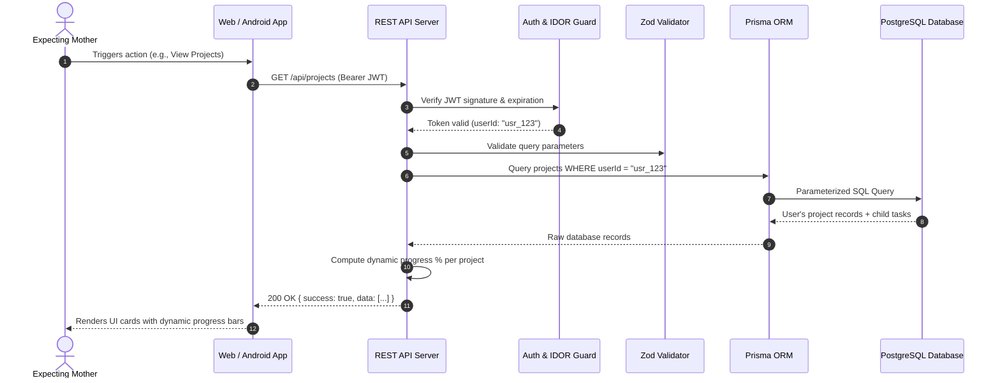
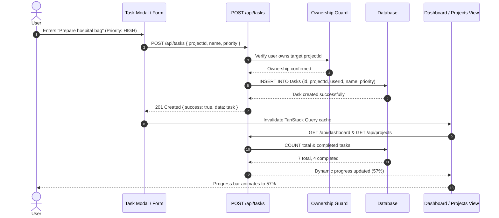
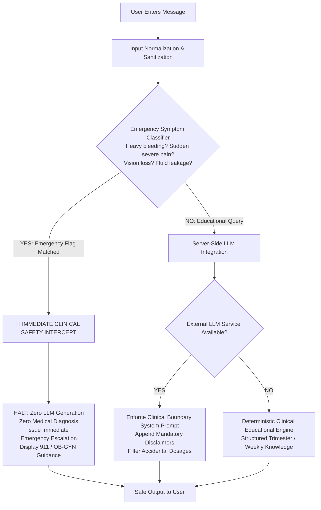
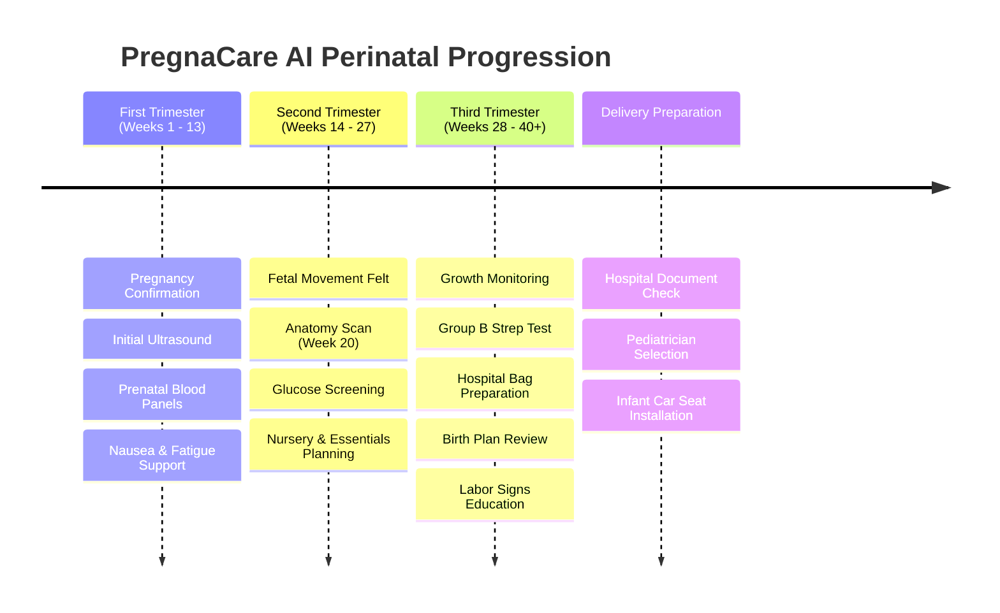
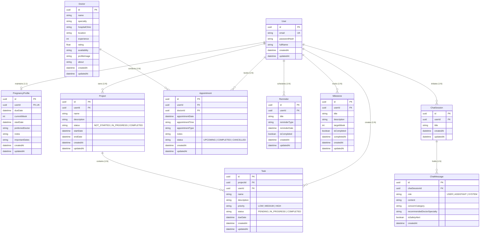
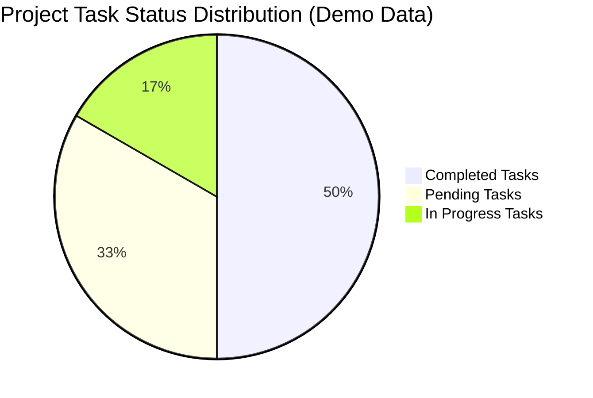
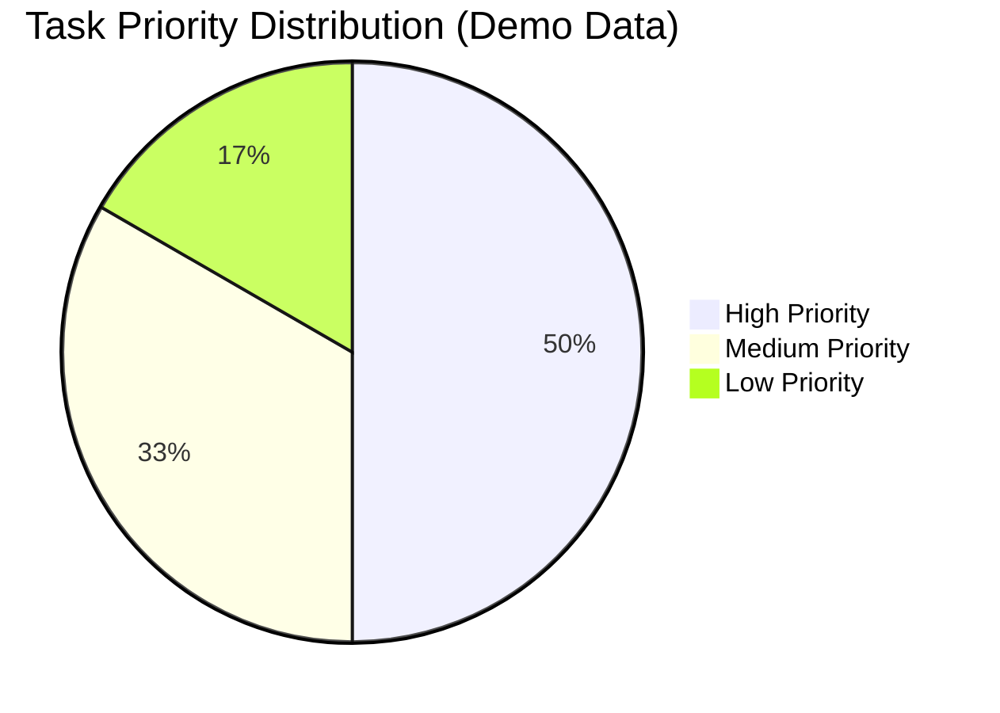
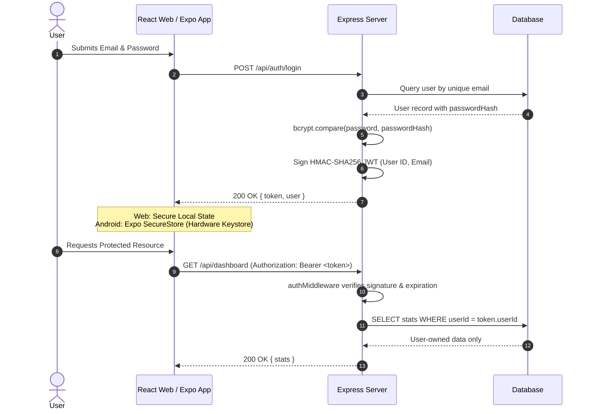
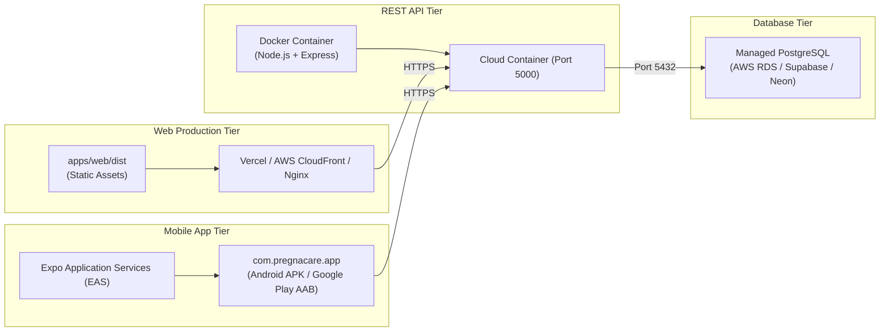

# PregnaCare AI

### *Your Intelligent Pregnancy Care Companion*

[](https://github.com/ishashwat/PregnaCare-AI/actions/workflows/ci.yml)
[](https://nodejs.org)
[](https://react.dev)
[](https://reactnative.dev)
[](https://expo.dev)
[](https://www.typescriptlang.org)
[](https://www.postgresql.org)
[](https://www.prisma.io)
[](https://www.docker.com)
[-6E9F18?logo=vitest)](https://vitest.dev)
[](https://opensource.org/licenses/MIT)

> **PregnaCare AI** is an enterprise-grade full-stack pregnancy care and organizational planning platform. It seamlessly unifies gestational milestones, week-by-week clinical education, simulated appointments, and project/task management across **Web (React)** and **Android (React Native / Expo)** via a **Single Shared REST Backend** and **Shared PostgreSQL Database**.

---

## 📌 Table of Contents

- [Project Overview](#project-overview)
- [Quick Project Snapshot](#quick-project-snapshot)
- [Feature Matrix](#feature-matrix)
- [System Architecture](#system-architecture)
- [Data Flow & Business Logic](#data-flow--business-logic)
- [Safety-First AI Architecture](#safety-first-ai-architecture)
- [Pregnancy Journey Visual](#pregnancy-journey-visual)
- [Database Schema & ER Diagram](#database-schema--er-diagram)
- [Dashboard at a Glance](#dashboard-at-a-glance)
- [Application Screenshots](#application-screenshots)
- [Technology Stack](#technology-stack)
- [REST API Reference](#rest-api-reference)
- [Authentication & Security](#authentication--security)
- [Medical Safety Notice](#medical-safety-notice)
- [Project Directory Structure](#project-directory-structure)
- [Local Setup & Quick Start](#local-setup--quick-start)
- [Environment Variables](#environment-variables)
- [Deployment Architecture](#deployment-architecture)
- [Cross-Platform Synchronization Demo](#cross-platform-synchronization-demo)
- [Testing & Quality Assurance](#testing--quality-assurance)
- [Engineering Highlights](#engineering-highlights)
- [Future Roadmap](#future-roadmap)
- [Contributing](#contributing)
- [License](#license)

---

<a id="project-overview"></a>
## 📖 Project Overview

Pregnancy is a life-changing journey involving dozens of medical visits, physiological adaptations, nursery preparations, and lifestyle adjustments. Expecting mothers are often forced to juggle scattered spreadsheets, generic to-do apps, and overwhelming web forums.

**PregnaCare AI** solves this fragmentation by combining:
1. **Clinical Pregnancy Tracking:** Gestational age countdown, trimester breakdown, and 40 weeks of curated anatomical and wellness guidance.
2. **Project & Task Management:** Structured preparation projects (*Hospital Preparation*, *First Trimester Checklist*, *Baby Essentials*) with live database-driven completion percentages.
3. **Care Coordination:** Fictional doctor directory, specialty search, and simulated consultation management with calendar tracking.
4. **Safety-First AI Companion:** Clinical triage layer intercepting red-flag emergencies, generating doctor visit questions, and delivering evidence-based perinatal education without diagnosing or prescribing.
5. **True Cross-Platform Parity:** One unified account and one database. Changes made on Web instantly sync to Android upon pull-to-refresh, and mobile updates immediately reflect on Web.

> *PregnaCare AI provides educational, organizational, and preparatory guidance. It does not provide medical diagnosis, clinical treatment, or pharmaceutical prescriptions.*

---

<a id="quick-project-snapshot"></a>
## ⚡ Quick Project Snapshot

| Area | Verified Implementation Capabilities |
|---|---|
| **Authentication** | User Registration, Login, Logout, Session Persistence, JWT HMAC-SHA256, 12-round salted bcrypt |
| **Pregnancy** | Pregnancy Profile, Due Date Countdown, Trimester Progress, 40-Week Anatomical Guide, Interactive Timeline |
| **Planning** | Pregnancy Projects, Priority Tasks (`HIGH`, `MEDIUM`, `LOW`), Status Toggles, Dynamic Progress (`%`), Reminders |
| **Care** | Fictional Doctor Directory, Specialty & Location Filtering, Simulated Consultations, Cancellation Flow |
| **Intelligence** | PregnaCare AI Assistant, Emergency Red-Flag Triage Interceptor, "Ask Your Doctor" Question Generator |
| **Education** | Perinatal Nutrition Guides, Safe Hydration & Protein, Wellness Modules (Sleep, Gentle Exercise, Stress) |
| **Progress** | Real-Time Dashboard (Zero Hardcoded Stats), Milestones Tracker (Target Weeks & Checkoffs) |
| **Platforms** | Responsive Web Application (React + Vite) + Native Android Application (React Native + Expo SDK 51) |

---

<a id="feature-matrix"></a>
## 📊 Feature Matrix

| Feature | Web App (`apps/web`) | Android App (`apps/mobile`) | Shared Backend (`server`) | Relational Database |
|---|:---:|:---:|:---:|:---:|
| **Authentication (JWT & bcrypt)** | ✓ | ✓ | ✓ | ✓ |
| **Pregnancy Profile & Due Date** | ✓ | ✓ | ✓ | ✓ |
| **Projects (CRUD & Filtering)** | ✓ | ✓ | ✓ | ✓ |
| **Tasks (Priority & Completion)** | ✓ | ✓ | ✓ | ✓ |
| **Dynamic Progress Calculation** | ✓ | ✓ | ✓ | ✓ |
| **Live Executive Dashboard** | ✓ | ✓ | ✓ | ✓ |
| **Doctor Discovery & Profiles** | ✓ | ✓ | ✓ | ✓ |
| **Simulated Appointments** | ✓ | ✓ | ✓ | ✓ |
| **AI Assistant & Safety Triage** | ✓ | ✓ | ✓ | ✓ |
| **"Ask Your Doctor" Generator** | ✓ | ✓ | ✓ | ✓ |
| **Pregnancy Milestones** | ✓ | ✓ | ✓ | ✓ |
| **Organizational Reminders** | ✓ | ✓ | ✓ | ✓ |
| **Perinatal Nutrition & Wellness** | ✓ | ✓ | ✓ | ✓ |
| **Hardware Keystore Token Security** | N/A (Web Storage) | ✓ (SecureStore) | ✓ | N/A |
| **Pull-to-Refresh Sync** | Browser Refresh | ✓ (Native RefreshControl)| ✓ | ✓ |

---

<a id="system-architecture"></a>
## 🏛️ System Architecture

PregnaCare AI enforces a strict multi-tier, zero-trust architecture. Both client frontends communicate exclusively with the shared REST API over authenticated HTTPS/JSON.



---

<a id="data-flow--business-logic"></a>
## 🔄 Data Flow & Business Logic

### 1. General Authenticated Request Flow


### 2. Task Creation & Live Progress Recalculation Flow


---

<a id="safety-first-ai-architecture"></a>
## 🛡️ Safety-First AI Architecture

PregnaCare AI implements an upstream clinical safety classification engine that protects expecting mothers from dangerous automated medical claims.



### Safety Principles Enforced:
- ❌ **No Disease Diagnosis:** Never outputs *"You have condition X"*.
- ❌ **No Pharmaceutical Prescriptions:** Refuses to suggest prescription drugs or antibiotics.
- ❌ **No Dosage Recommendations:** Rejects questions asking for specific milligram dosages or frequencies.
- ❌ **No Dismissal of Symptoms:** Never reassures a patient that an acute red-flag symptom is *"harmless"*.
- ✅ **Prompt Escalation:** Provides non-alarming, direct instructions to seek urgent obstetric evaluation.

---

<a id="pregnancy-journey-visual"></a>
## 📅 Pregnancy Journey Visual

The 40-week perinatal journey is structured into three distinct clinical trimesters, followed by preparation for labor and delivery:



---

<a id="database-schema--er-diagram"></a>
## 🗄️ Database Schema & ER Diagram

The database schema is managed via **Prisma ORM** with 10 core relational models. In production and Docker, PostgreSQL is utilized; for local standalone development, an automated SQLite switch (`dev.db`) is provided.



### Relational Integrity Highlights:
1. **Ownership Isolation (IDOR Prevention):** Every user entity enforces `userId` foreign keys. Controllers verify ownership on every operation.
2. **Cascading Deletions:** Deleting a user safely cascades to delete their profile, projects, tasks, reminders, milestones, appointments, and chat sessions. Deleting a project cascades to its tasks.
3. **Doctor Normalization:** `Doctor` records are independently maintained and referenced by appointments without duplicating specialist metadata.

---

<a id="dashboard-at-a-glance"></a>
## 📈 Dashboard at a Glance

The PregnaCare AI dashboard aggregates real-time metrics across pregnancy progression and project management without hardcoded statistics:

```
┌────────────────────────────────────────────────────────────────────────┐
│  Good Morning, Sarah 👋                                               │
│  "Your Intelligent Pregnancy Care Companion"                           │
├────────────────────────────────────────────────────────────────────────┤
│  🤰 CURRENT PREGNANCY STATUS                                           │
│  Week 24 of 40 • Second Trimester • 112 Days Remaining                 │
│  ██████████████████████████████░░░░░░░░░░░░  60% Gestational Progress  │
├──────────────────────┬──────────────────────┬──────────────────────────┤
│  📁 TOTAL PROJECTS   │  📋 TOTAL TASKS      │  ✅ COMPLETED TASKS      │
│  2 Active Projects   │  6 Tasks Tracked     │  3 Completed (50%)       │
├──────────────────────┼──────────────────────┼──────────────────────────┤
│  ⏳ PENDING TASKS    │  🩺 UPCOMING VISITS  │  🏆 MILESTONES ACHIEVED  │
│  3 Tasks Remaining   │  1 Consultation      │  4 Completed             │
└──────────────────────┴──────────────────────┴──────────────────────────┘
```

### Illustrative Distribution (From Demo Database)





---

<a id="application-screenshots"></a>
## 📸 Application Screenshots

Visual captures of the running platform are maintained in the [`docs/screenshots/`](docs/screenshots/) directory.

| Web Dashboard | Web Project Management |
|:---:|:---:|
| *(Gestational Countdown, Live Statistics)*<br/>[`docs/screenshots/dashboard.png`](docs/screenshots/) | *(Dynamic Progress Bars & Filters)*<br/>[`docs/screenshots/projects.png`](docs/screenshots/) |

| PregnaCare AI Assistant | Doctor Discovery |
|:---:|:---:|
| *(Safety Triage & Clinical Education)*<br/>[`docs/screenshots/ai-assistant.png`](docs/screenshots/) | *(Specialty & Location Filtering)*<br/>[`docs/screenshots/doctors.png`](docs/screenshots/) |

| Android Mobile Dashboard | Android Task Planning |
|:---:|:---:|
| *(Native Bottom Navigation & Pull-to-Refresh)*<br/>[`docs/screenshots/mobile-dashboard.png`](docs/screenshots/) | *(Secure Token Storage & Mobile Add Modal)*<br/>[`docs/screenshots/mobile-tasks.png`](docs/screenshots/) |

> *To capture or update local screenshots, start the web server at `http://localhost:5173` and mobile bundler at `http://localhost:8081`, log in with `demo@pregnacare.com`, and save snapshots to `docs/screenshots/` according to [`docs/screenshots/README.md`](docs/screenshots/README.md).*

---

<a id="technology-stack"></a>
## 💻 Technology Stack

| Layer | Verified Technology | Version / Spec | Purpose in System |
|---|---|---|---|
| **Web Frontend** | React | 18.3.1 | Component-driven reactive Single Page Application |
| **Web Build Tool** | Vite | 5.2.11 | Fast HMR and optimized production bundling |
| **Web Styling** | Tailwind CSS | 3.4.3 | Responsive healthcare-inspired design tokens |
| **Web Navigation** | React Router DOM | 6.23.1 | Client-side routing and protected route guards |
| **Web State & Cache**| TanStack Query | 5.39.0 | Server-state caching and background synchronization |
| **Web Forms** | React Hook Form + Zod | 7.51 / 3.23 | Type-safe form validation and schema parsing |
| **Web Visuals** | Recharts & Lucide React | 2.12 / 0.379 | Perinatal milestone charts and accessible iconography |
| **Mobile Frontend** | React Native | 0.74.5 | Cross-platform native mobile application |
| **Mobile Runtime** | Expo | SDK 51.0.28 | Native runtime, EAS build pipeline, and developer tools |
| **Mobile Navigation**| React Navigation | 6.x | Native Bottom Tab and Stack Navigators |
| **Mobile Security** | Expo SecureStore | 13.0.2 | Hardware-backed encrypted keystore for JWT persistence |
| **Backend API** | Node.js + Express.js | 20.x / 4.19 | REST API routing, controllers, and middleware |
| **Language** | TypeScript | 5.4.5 | End-to-end type safety across client, server, and packages |
| **ORM** | Prisma ORM | 5.22.0 | Type-safe query builder and database migrations |
| **Database** | PostgreSQL / SQLite | 16 / dev.db | Relational persistence with foreign keys and cascade rules |
| **Authentication** | JSON Web Tokens (JWT) | 9.0.2 | Stateless signed session authentication |
| **Password Hashing**| bcryptjs | 2.4.3 | 12-round salted password hashing |
| **API Security** | Helmet & CORS | 7.1 / 2.8 | Defensive HTTP response headers and origin controls |
| **Rate Limiting** | express-rate-limit | 7.2.0 | Sliding-window brute force and DoS prevention |
| **Testing** | Vitest + Supertest | 1.6.0 / 7.0 | Automated unit, integration, and security test suites |
| **DevOps** | Docker Compose | 3.8 | Multi-container PostgreSQL and backend deployment |

---

<a id="rest-api-reference"></a>
## 🔌 REST API Reference

All protected endpoints require a `Bearer <token>` in the `Authorization` header.

### 1. Authentication (`/api/auth`)
| Method | Endpoint | Auth Required | Purpose |
|---|---|:---:|---|
| `POST` | `/api/auth/register` | No | Registers a new user with email, name, and hashed password |
| `POST` | `/api/auth/login` | No | Validates credentials and returns signed JWT token |
| `POST` | `/api/auth/logout` | Yes | Terminates client session |
| `GET` | `/api/auth/me` | Yes | Retrieves current authenticated user profile |

### 2. Pregnancy Profile (`/api/pregnancy`)
| Method | Endpoint | Auth Required | Purpose |
|---|---|:---:|---|
| `GET` | `/api/pregnancy/profile` | Yes | Returns gestational week, trimester, due date, and notes |
| `POST` | `/api/pregnancy/profile` | Yes | Creates initial pregnancy profile |
| `PUT` | `/api/pregnancy/profile` | Yes | Updates due date, preferred doctor, or notes |

### 3. Project Management (`/api/projects`)
| Method | Endpoint | Auth Required | Purpose |
|---|---|:---:|---|
| `GET` | `/api/projects` | Yes | Lists user's projects with dynamic progress % (supports `search`, `status`) |
| `GET` | `/api/projects/:id` | Yes | Retrieves single project details with all child tasks |
| `POST` | `/api/projects` | Yes | Creates new pregnancy project |
| `PUT` | `/api/projects/:id` | Yes | Updates project name, description, or status |
| `DELETE` | `/api/projects/:id` | Yes | Deletes project and cascades to delete all child tasks |

### 4. Task Management (`/api/tasks`)
| Method | Endpoint | Auth Required | Purpose |
|---|---|:---:|---|
| `GET` | `/api/tasks` | Yes | Lists tasks (supports `projectId`, `status`, `priority`, `search`) |
| `GET` | `/api/tasks/:id` | Yes | Retrieves single task |
| `POST` | `/api/tasks` | Yes | Creates task associated with project |
| `PUT` | `/api/tasks/:id` | Yes | Modifies task name, priority, or due date |
| `DELETE` | `/api/tasks/:id` | Yes | Deletes task with IDOR protection |
| `PATCH` | `/api/tasks/:id/complete`| Yes | Toggles task completion (`COMPLETED` <-> `PENDING`) |
| `PATCH` | `/api/tasks/:id/status` | Yes | Updates task status (`PENDING`, `IN_PROGRESS`, `COMPLETED`) |

### 5. Doctor Directory & Appointments (`/api/doctors`, `/api/appointments`)
| Method | Endpoint | Auth Required | Purpose |
|---|---|:---:|---|
| `GET` | `/api/doctors` | Yes | Lists fictional doctors (supports `search`, `specialty`, `location`) |
| `GET` | `/api/doctors/:id` | Yes | Retrieves detailed doctor profile and availability |
| `GET` | `/api/appointments` | Yes | Lists user's scheduled consultations |
| `POST` | `/api/appointments` | Yes | Schedules simulated consultation with specialist |
| `PATCH` | `/api/appointments/:id/cancel`| Yes| Cancels upcoming appointment |

### 6. AI & Clinical Question Preparation (`/api/chat`)
| Method | Endpoint | Auth Required | Purpose |
|---|---|:---:|---|
| `POST` | `/api/chat` | Yes | Sends prompt through Safety Triage Engine before LLM |
| `POST` | `/api/chat/ask-doctor` | Yes | Generates structured questions for clinical consultation |
| `GET` | `/api/chat/sessions` | Yes | Lists user's conversational history sessions |

### 7. Executive Dashboard & Health (`/api/dashboard`, `/api/health`)
| Method | Endpoint | Auth Required | Purpose |
|---|---|:---:|---|
| `GET` | `/api/dashboard` | Yes | Computes real database-derived statistics across all modules |
| `GET` | `/api/health` | No | System health check (`200 OK`) |

---

<a id="authentication--security"></a>
## 🔒 Authentication & Security

### End-to-End Authentication Flow


### Security Defenses Implemented:
- **Zero-Trust Ownership (IDOR Prevention):** Every query uses dual-predicate filtering (`where: { id: entityId, userId: tokenUserId }`). Users can never access other accounts' records.
- **Hardware Keystore Storage on Mobile:** JWTs on Android are saved via `expo-secure-store` interfacing with Android's hardware-backed Keystore system.
- **SQL Injection Defense:** All queries utilize Prisma ORM parameterized AST builders; raw SQL concatenation is strictly forbidden.
- **Defensive Headers & Rate Limiting:** Protected via `helmet` and `express-rate-limit` (Auth: 10 req/15min, Chat: 20 req/15min).

---

<a id="medical-safety-notice"></a>
## ⚕️ Medical Safety Notice

> ### ⚠️ Critical Medical Disclaimer
> **PregnaCare AI provides general educational and organizational support.**
> 
> - **PregnaCare AI is NOT a doctor, hospital, diagnostic system, emergency service, or prescription provider.**
> - The information provided does not replace professional clinical evaluation, diagnosis, or personalized medical care.
> - **Emergency Situations:** If you experience severe abdominal pain, heavy vaginal bleeding, sudden vision disturbances, severe headaches, fluid leakage, or reduced fetal movement, **immediately contact your OB-GYN, midwife, or proceed to the nearest hospital emergency room.**

---

<a id="project-directory-structure"></a>
## 📂 Project Directory Structure

```
PregnaCare-AI/
├── .github/
│   └── workflows/
│       └── ci.yml                     # GitHub Actions CI workflow (Test & Build)
├── apps/
│   ├── web/                           # Responsive React 18 Web Application
│   │   ├── src/
│   │   │   ├── __tests__/             # Frontend Vitest suite (15 tests passing)
│   │   │   ├── api/client.ts          # Axios HTTP client with JWT interceptor
│   │   │   ├── components/            # Sidebar, Navbar, Layout, ConfirmModal, etc.
│   │   │   ├── contexts/AuthContext   # Global auth state & token persistence
│   │   │   ├── pages/                 # All 21 pages (Dashboard, Projects, Timeline, etc.)
│   │   │   └── App.tsx                # React Router DOM routing
│   │   ├── dist/                      # Optimized production build bundle
│   │   ├── package.json
│   │   ├── tailwind.config.js
│   │   └── vite.config.ts
│   └── mobile/                        # Native Android Mobile App (Expo SDK 51)
│       ├── src/
│       │   ├── api/client.ts          # Mobile API client with Expo SecureStore
│       │   ├── contexts/AuthContext   # Mobile authentication context
│       │   ├── navigation/            # Bottom Tab Navigator & Stack Navigation
│       │   └── screens/               # Dashboard, Planning, Care, Pregnancy, AI, Profile
│       ├── app.json                   # Expo package config (com.pregnacare.app)
│       ├── index.js                   # Expo root component registration
│       └── package.json
├── server/                            # Node.js + Express REST API Backend
│   ├── src/
│   │   ├── config/                    # Typed environment variables
│   │   ├── controllers/               # Auth, Pregnancy, Project, Task, Doctor, AI, etc.
│   │   ├── middleware/                # JWT auth, Zod validation, Rate limiter, Error handler
│   │   ├── routes/                    # API route definitions
│   │   ├── services/                  # AISafetyService (Triage), AIService (LLM/Fallback)
│   │   ├── utils/                     # Structured Logger, ApiResponse helpers
│   │   ├── app.ts                     # Express app setup with Helmet & CORS
│   │   └── index.ts                   # Server bootstrap listener
│   ├── prisma/
│   │   ├── schema.pg.prisma           # PostgreSQL production schema
│   │   ├── schema.sqlite.prisma       # SQLite development fallback schema
│   │   └── seed.ts                    # Seeds 3 demo users & 5 fictional doctors
│   ├── scripts/prepare-db.js          # Dynamic schema selector based on DATABASE_URL
│   ├── tests/api.test.ts              # Backend integration test suite (26 tests passing)
│   └── package.json
├── packages/
│   ├── shared-types/src/index.ts      # Shared TypeScript domain interfaces
│   └── validation/src/index.ts        # Shared Zod validation schemas
├── docs/
│   ├── architecture.md                # System architecture documentation
│   ├── database.md                    # Database documentation
│   ├── ER-DIAGRAM.md                  # Relational Mermaid ER diagram
│   ├── api.md                         # Comprehensive REST API specifications
│   ├── security.md                    # Security & threat model manual
│   ├── ai-safety.md                   # Clinical triage & AI safety rules
│   ├── deployment.md                  # Docker & EAS deployment guide
│   ├── README-VERIFICATION.md         # Verification audit matrix
│   └── screenshots/                   # Application screenshots directory
├── docker-compose.yml                 # PostgreSQL & REST Backend multi-container setup
├── .env.example                       # Environment variable template
├── package.json                       # Monorepo root workspace configuration
└── README.md
```

---

<a id="local-setup--quick-start"></a>
## 🛠️ Local Setup & Quick Start

### Prerequisites
- **Node.js:** v20.x or higher
- **npm:** v10.x or higher
- **Git**

---

### Step 1: Clone Repository & Install Dependencies
```bash
git clone https://github.com/ishashwat/PregnaCare-AI.git
cd PregnaCare-AI

# Install all monorepo dependencies across workspaces
npm install
```

---

### Step 2: Configure Environment Variables
Copy the template configuration:
```bash
cp .env.example .env
```
*(The default configuration enables local development without requiring external API keys).*

---

### Step 3: Initialize Database & Seed Demo Data
```bash
cd server

# Prepare Prisma schema (detects DATABASE_URL or defaults to local dev.db)
npm run db:prepare
npx prisma generate
npx prisma db push

# Seed 3 demo users and 5 fictional doctors
npm run db:seed
```

---

### Step 4: Run Automated Verification Tests
Validate both backend and frontend suites:
```bash
# Backend REST API integration & security tests (26 passing)
cd server
npm test

# Frontend unit and logic tests (15 passing)
cd ../apps/web
npm test
```

---

### Step 5: Start Development Servers

#### Terminal 1 — REST API Backend:
```bash
cd server
npm run dev
# Server active at http://localhost:5000
# Health check: http://localhost:5000/api/health
```

#### Terminal 2 — React Web Application:
```bash
cd apps/web
npm run dev
# Web application active at http://localhost:5173
```

#### Terminal 3 — Android Mobile Application (Expo):
```bash
cd apps/mobile
npx expo start
# Scan the QR code in Expo Go on Android, or press 'a' for Android Emulator
```

---

### Pre-Seeded Demo Accounts

| Email | Password | Gestational Stage | Current Week |
|---|---|---|---|
| `demo@pregnacare.com` | `Password123!` | Second Trimester | Week 24 |
| `emily@pregnacare.com` | `Password123!` | First Trimester | Week 12 |
| `olivia@pregnacare.com` | `Password123!` | Third Trimester | Week 34 |

---

<a id="environment-variables"></a>
## 🔐 Environment Variables

| Variable | Scope | Purpose | Required | Default / Example |
|---|---|---|:---:|---|
| `DATABASE_URL` | Backend | PostgreSQL connection URI or SQLite file path | Yes | `file:./dev.db` (Local) / `postgresql://...` |
| `PORT` | Backend | HTTP port for REST server | No | `5000` |
| `NODE_ENV` | Backend | Runtime mode (`development`, `test`, `production`) | No | `development` |
| `JWT_SECRET` | Backend | Cryptographic key for HMAC-SHA256 JWT signing | Yes | `pregnacare_ai_super_secret_jwt_key_2026_dev_mode` |
| `JWT_EXPIRES_IN` | Backend | Token validity duration | No | `7d` |
| `CORS_ORIGIN` | Backend | Allowed cross-origin domains (comma-separated) | No | `http://localhost:5173,http://localhost:3000` |
| `LLM_API_KEY` | Backend | Google Gemini API key (Stored only on server) | No | *(Fallback engine runs if absent)* |
| `VITE_API_URL` | Web | Base URL for REST API requests | Yes | `http://localhost:5000/api` |
| `EXPO_PUBLIC_API_URL`| Mobile | Backend API endpoint accessed by mobile client | Yes | `http://10.0.2.2:5000/api` (Emulator) |

---

<a id="deployment-architecture"></a>
## 🚀 Deployment Architecture



### Option A: Docker Compose Deployment
```bash
# Launch PostgreSQL and REST Backend containers
docker compose up -d --build

# Run migrations and seed data in container
docker compose exec backend npx prisma migrate deploy
docker compose exec backend npx prisma db seed
```

### Option B: Mobile EAS Build (Android)
```bash
cd apps/mobile
npm install -g eas-cli
eas login
eas build --platform android --profile preview
```
*(For detailed production instructions, see [`docs/deployment.md`](docs/deployment.md)).*

---

<a id="cross-platform-synchronization-demo"></a>
## 🔁 Cross-Platform Synchronization Demo

A core requirement of PregnaCare AI is real-time bidirectional synchronization between Web and Android via the shared database.

```
                  WEB CLIENT                                   ANDROID CLIENT
                      │                                              │
         1. Create Task on Web                                       │
      "Prepare Hospital Documents"                                   │
                      │                                              │
                      ▼                                              │
         POST /api/tasks (Bearer JWT)                                │
                      │                                              │
                      ▼                                              │
              SHARED REST BACKEND                                    │
                      │                                              │
                      ▼                                              │
             POSTGRESQL DATABASE                                     │
                      │                                              │
                      └─────────────────┐                            │
                                        │ 2. Pull-to-Refresh on Android
                                        ▼                            │
                               GET /api/tasks (Bearer JWT)           │
                                        │                            │
                                        └───────────────────────────►│
                                                              Task Appears!
                                                                     │
                                                       3. Mark Task Complete
                                                              on Android
                                                                     │
                                        ┌────────────────────────────┘
                                        │ PATCH /api/tasks/:id/complete
                                        ▼
                               SHARED REST BACKEND
                                        │
                                        ▼
                               POSTGRESQL DATABASE
                                        │
                      ┌─────────────────┘
                      │ 4. Refresh Browser on Web
                      ▼
            GET /api/dashboard & GET /api/projects
                      │
           Task Displays as Completed!
           Project Progress Updates to 100%!
```

---

<a id="testing--quality-assurance"></a>
## 🧪 Testing & Quality Assurance

PregnaCare AI includes **41 automated tests** across the stack:

| Test Suite | Location | Tests Passed | Test Focus |
|---|---|:---:|---|
| **Backend API & Security** | `server/tests/api.test.ts` | **26 / 26** | Auth, Duplicate Email, JWT validation, IDOR Ownership Protection, Project/Task CRUD, Dynamic Math, Appointments, AI Safety Triage |
| **Frontend Unit & Logic** | `apps/web/src/__tests__/web.test.ts`| **15 / 15** | Zod Form Validation, Matching Passwords, Task Filters, Project Progress Percentage, Trimester Categorization |

### Running the Test Suites:
```bash
# Run Backend Integration Tests
cd server
npm test

# Run Frontend Logic Tests
cd apps/web
npm test
```

---

<a id="engineering-highlights"></a>
## 🏆 Engineering Highlights

- **Professional Monorepo Architecture:** Clean separation of concerns with npm workspaces (`server`, `apps/web`, `apps/mobile`, `packages/shared-types`, `packages/validation`).
- **Dynamic Math Engine:** Project completion percentages and dashboard metrics are computed in real time from relational database state rather than stored as static counters.
- **Fail-Safe AI Degradation:** Deterministic perinatal education engine steps in seamlessly if external AI endpoints experience latency or API key exhaustion.
- **Zero-Trust IDOR Prevention:** Strict verification that the authenticated user owns any target project or task before mutating database state.
- **Automated CI/CD Pipeline:** Fully configured GitHub Actions workflow (`.github/workflows/ci.yml`) validating compilation, automated tests, and web production build on every push and pull request.

---

<a id="future-roadmap"></a>
## 🗺️ Future Roadmap

*(Planned extensions — Not currently implemented)*
- [ ] **Push Notifications:** Native push alerts for upcoming appointments and milestone reminders via Expo Notifications.
- [ ] **Offline SQLite Sync:** Offline cache queue on Android syncing transactions once connectivity is restored.
- [ ] **Wearable Integration:** Apple HealthKit and Google Health Connect sync for maternal vitals and sleep telemetry.
- [ ] **Multi-Language Perinatal Support:** Localization into Spanish, French, and Hindi.
- [ ] **Direct Provider Portal:** Two-way encrypted clinical messaging for verified obstetric practices.

---

<a id="contributing"></a>
## 🤝 Contributing

1. Fork the repository (`git fork https://github.com/ishashwat/PregnaCare-AI`).
2. Create your feature branch (`git checkout -b feature/clinical-milestone-enhancement`).
3. Commit your changes (`git commit -m 'feat: add enhanced fetal growth milestone tracker'`).
4. Ensure all tests pass (`npm test --workspaces`).
5. Push to the branch (`git push origin feature/clinical-milestone-enhancement`).
6. Open a Pull Request.

---

<a id="license"></a>
## 📄 License

This project is licensed under the **MIT License** — see the [`package.json`](package.json) file for details.
