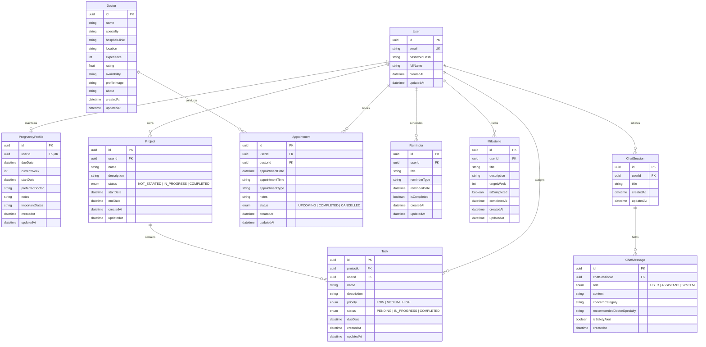

# PregnaCare AI - Database Entity-Relationship Diagram (ERD)

## Relationship & Integrity Rules

1. **Strict User Ownership**:
   - Every user-specific record (`PregnancyProfile`, `Project`, `Task`, `Appointment`, `Reminder`, `Milestone`, `ChatSession`) contains a direct `userId` foreign key.
   - The backend enforces JWT ownership matching on every read, update, and delete operation (preventing Insecure Direct Object References - IDOR).

2. **Cascade Deletions**:
   - Deleting a `User` cascades to delete their `PregnancyProfile`, `Projects`, `Tasks`, `Appointments`, `Reminders`, `Milestones`, and `ChatSessions`.
   - Deleting a `Project` automatically cascades to delete all child `Tasks`.
   - Deleting a `ChatSession` cascades to delete all child `ChatMessages`.

3. **Data Normalization**:
   - `Doctor` is an independent directory model referenced by `Appointment`. Fictional doctors can serve multiple patient appointments.
